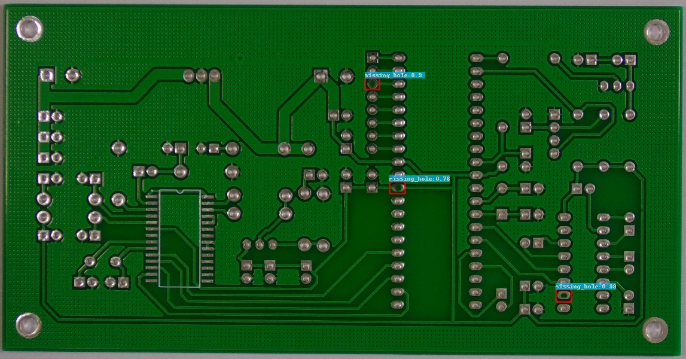
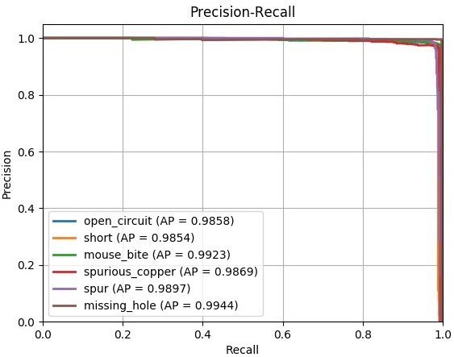

# PCB-defect-detection
## Note 
This project code is forked from https://github.com/DetectionTeamUCAS/FPN_Tensorflow. I have only made minor changes on this wonderful and clear project. Thanks for their perfect code. I can learn and apply it to a new problem.
##  PCB defect dataset
The Open Lab on Human Robot Interaction of Peking University has released the PCB defect dataset.

You can download at http://robotics.pkusz.edu.cn/resources/dataset/. 

More datails about this dataset: https://arxiv.org/pdf/1901.08204.pdf. 

6 types of defects are made by photoshop, a graphics editor published by Adobe Systems. The defects defined in the dataset are: missing hole, mouse bite, open circuit, short, spur, and spurious copper. 
For example:

.png)
### Dataset Update
The paper of this project will be update.
However, the defect images of raw dataset are high-resolution. 
With the respect of such small dataset, data augmentation techniques are adopted before data training. The images are then cropped
into 600 × 600 sub-images, forming our training set and testingset with 9920 and 2508 images, respectively.

You can download augmented dataset: https://pan.baidu.com/s/1eAxDF4txpgMInxbmNDX0Zw code: a6rh

The augmented dataset contains 10668 images and the corresponding annotation files.

Note: This augmented dataset is privately owned, if you want to use it in your paper, please contact me.

## Download Model
Please download [resnet50_v1](http://download.tensorflow.org/models/resnet_v1_50_2016_08_28.tar.gz)、[resnet101_v1](http://download.tensorflow.org/models/resnet_v1_101_2016_08_28.tar.gz) pre-trained models on Imagenet, put it to $PATH_ROOT/data/pretrained_weights. 
## My Development Environment
1、python2.7 (anaconda recommend)             
2、CUDA Version 8.0.44 , CUDNN=5.1.10           
3、[opencv(cv2)](https://pypi.org/project/opencv-python/)    
4、[tfplot](https://github.com/wookayin/tensorflow-plot)             
5、tensorflow == 1.121 

## Compile
```  
cd $PATH_ROOT/libs/box_utils/cython_utils
python setup.py build_ext --inplace
```

## Demo(available)

Select a configuration file in the folder ($PATH_ROOT/libs/configs/) and copy its contents into cfgs.py.

Then download the corresponding [weights](https://pan.baidu.com/s/1rvHjihG1fL499SqU28Nang). code：shac 

```   
cd $PATH_ROOT/tools
python inference.py --data_dir='/PATH/TO/THE/TO/BE/DETECTED/IMAGES/' 
                    --save_dir='/PATH/TO/SAVE/RESULTS/' 
                    --GPU='0'
```
After running this code, you will get the detected image in your 'save_dir' path.

## Train
If you want to train your own data, please follow this project: https://github.com/DetectionTeamUCAS/FPN_Tensorflow

1、Modify parameters (such as CLASS_NUM, DATASET_NAME, VERSION, etc.) in $PATH_ROOT/libs/configs/cfgs.py    

2、Generate train and test floder
(1) 

```  
cd $PATH_ROOT/data/io/  
python divide_data.py 

```    
You should check the image_path and xml_path in the 'divide_data.py'

2、Make tfrecord 

(1)Modify parameters (such as VOC_dir, xml_dir, image_dir, dataset, etc.) in $PATH_ROOT/data/io/convert_data_to_tfrecord.py   
```  
cd $PATH_ROOT/data/io/  
python convert_data_to_tfrecord.py 
```     

3、Train
```  
cd $PATH_ROOT/tools
python train.py
```

## Eval
```  
cd $PATH_ROOT/tools
python eval.py --eval_imgs='/PATH/TO/THE/TO/BE/EVALED/IMAGES/'  
               --annotation_dir='/PATH/TO/TEST/ANNOTATION/'
               --GPU='0'
```   
After running this code, you will get the precision, recall and AP of per defect type.

## Some results 
[the more results](https://github.com/Ixiaohuihuihui/PCB-defect-detection/tree/master/tools/inference_results)



## The Precision and Recall curve (PR)

