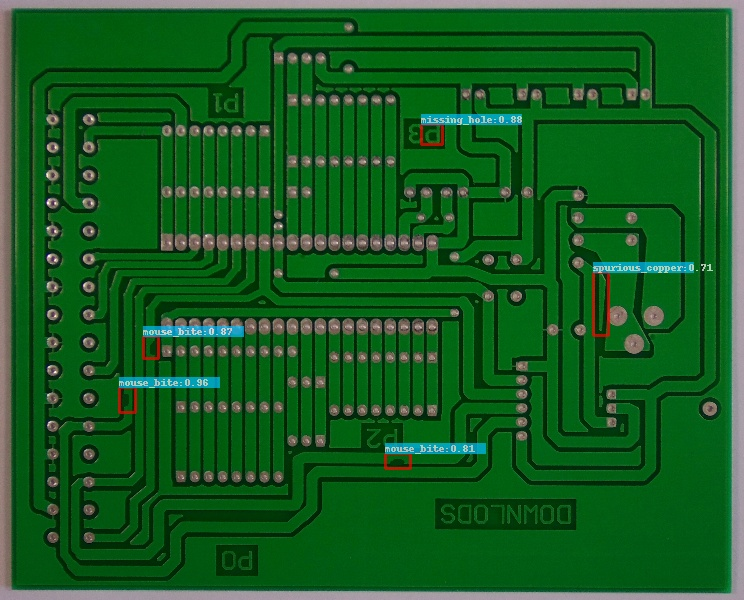

# PCB-defect-detection
## Note 
This project code is forked from https://github.com/DetectionTeamUCAS/FPN_Tensorflow. I have only made minor changes on this wonderful and clear project. Thanks for their perfect code. I can learn and apply it to a new problem.
##  PCB defect dataset
The Open Lab on Human Robot Interaction of Peking University has released the PCB defect dataset.

You can download at http://robotics.pkusz.edu.cn/resources/dataset/. 

And another student has published his paper "A PCB Dataset for Defects Detection and Classification" on arxiv. More datails about this dataset: https://arxiv.org/pdf/1901.08204.pdf. 

6 types of defects are made by photoshop, a graphics editor published by Adobe Systems. The defects defined in the dataset are: missing hole, mouse bite, open circuit, short, spur, spurious copper. 
For example:
.png)
## Some results 

